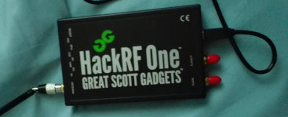
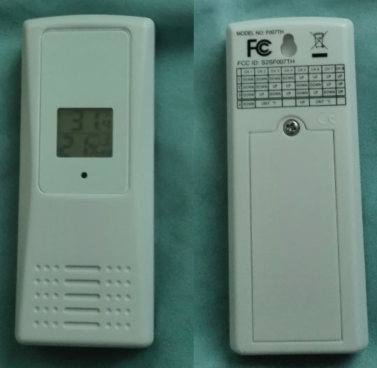

As a birthday present to myself I bought a HackRF One. The HackRF is a Software 
Defined Radio, which can send/receive anything between 1 MHz and 6 GHz, with a 
sampling frequency up to 20 MSps. It costs about $300, however, everything
described in here can be replicated with a $20 RTL-SDR dongle (which is unable 
to transmit and has a lower sample rate). An SDR works by mixing i.e., multiplying 
the received signal with a sine and cosine of (roughly) the target frequency. 
The results are two samples, called I and Q.

While visiting my friend Jim, he showed me his weather station, which displays up
to 4 inputs from battery powered temperature and humidity sensors. As a first project
to play with the HackRF I decided to try and decode the data sent by the sensors.



## Turning Radiowaves into Bits

The sensor sends a burst of data on 433.9 MHz once
every minute. I recorded such bursts in [gqrx](gqrx.dk) and parsed the gqrx output
with a simple program (isolate_signal.c) to turn the I/Q samples into complex
numbers readable by R. 

```{r}
library("ggplot2")
sig <- read.table("../samples/squelched_gqrx_20161212_191815_432000000_8000000_fc.raw.gz")
len <- length(sig$V1)
data = data.frame(sample=seq(1, len), magnitude=abs(sig$V1))
```

Since the FCC documentation tells us that the sender uses ASK, we only
care about the magnitude of each sample. If we plot a single burst
(decimated by a factor of 100) we get

```{r}
# lets look at the data
ggplot(data=data[seq(1, length(data$sample), 100),], aes(x=sample, y=magnitude)) + geom_line()
```

There are many points around zero, even during the burst, thus I assume
the sender actually uses OOK, and everything above half the recorded maximum
will be regarded as "on", everything below as "off". We apply a moving average
to get rid of outlier samples, then consider everything above 0.75 the maximum value a high sample, represented by a one, everything else zero.


```{r}
moving_average <- function(x,n=50){filter(x,rep(1/n,n), sides=2)}
data$magnitude = moving_average(data$magnitude)
data = data[complete.cases(data), ]
data$bin = as.integer(data$magnitude > 0.75*max(data$magnitude))
ggplot(data=data[seq(5e5, 7e5),], aes(x=sample, y=bin)) + geom_line() + geom_point()
```

That actually looks like data (note that this is also a zoomed in plot).
It seems there are short and long pulses. Let us take a look at the pulse
lengths (after removing the silence at the start/end):

```{r}
rledata = rle(data$bin)
rledata = data.frame(idx=seq(1, length(rledata$values)), lengths=rledata$lengths, values=rledata$values)
rledata = rledata[seq(2, length(rledata$idx)-1), ] #remove the "silence" before and after
divider =  min(rledata$lengths) + (max(rledata$lengths) - min(rledata$lengths)) / 2  # find the middle between long and short runs
ggplot(data=rledata, aes(x=idx, y=lengths, color=as.factor(values))) + 
  geom_point() + 
  geom_hline(yintercept=divider) +
  scale_color_discrete("Value") +
  scale_x_continuous("Pulse") +
  scale_y_continuous("Pulse Length")
```

Low periods (Value 0) seem to be always a little bit longer than high
periods (Value 1). Thus, there are only two different period lengths,
which we refer to as "short" and "long". We can safely classify them by
checking if they are above or below min+(max-min)/2.  We can now encode the
data in a bit string, long periods will be represented as a value beeing
repeated twice.

```{r}
repcnt = as.integer(rledata$lengths > divider) + 1
bitstr = paste(rep(rledata$values, repcnt), sep="", collapse="")
bitstr
```

The fact that we have only two different period lengths, hints that the
zeroes and ones are not actually data bits. A common encoding which leads
to this pattern is Manchester coding, which xors the data stream with the
clock. Each data bit is an entire clock period long. 
To assist clock recovery, data packets usually start with a 
lead-in of all ones or all zeroes. If the Manchester code assumption is
correct, we should have an even number of bits in our string, and when
broken into two character sequences, there should be only "10" and "01".

```{r}
bigrams = sapply(seq(from=1, to=nchar(bitstr), by=2), function(i) substr(bitstr, i, i+1))
bigrams
unique(bigrams)
```
This seems to fit :). Now the only decision to make is how to map those
bigrams to 0 and 1. According to Wikipedia, both conventions exist, but
it seems more common to use "high/low" to encode 1, so let's go with that.

```{r}
bits = paste(match(bigrams, c("01", "10")) - 1, sep="", collapse="")
bits
```

Turns out the same data is transmitted three times.

```{r, echo=FALSE}
decoded = c()
for (k in 0:2) {decoded[k+1]=substr(bits, 1+k*65, (k+1)*65)}
decoded
```

## Let's automate that

To identify the meaning of each bit, we need a lot more samples, at
different temperatures and humidities. To get that, it would be nice to
further automate our toolchain. I considered three options for that:

* Writing a HackRF library for GNU R
* Writing the decoder code in a language that has libhackrf bindings
* Using GNU Radio, a toolbox for SDR projects

While R is great to take an initial look at a recorded signal, it is
probably not a good choice for decoding a signal in real time, since
R works with static chunks of data, not with a data stream.

Writing the decoder code from scratch is labor-intensive and hard to debug
for the same reason (I tried, after hitting some snags with gnu radio),
for some things it's really nice to have a "animated" plot of your signal
possibly the ability to change some values using simple sliders, etc. Coding
that in C or Perl is a work I did not want to do.

So I decided to take the third option (which has the capabilities described
above), and basically replicate what we did above using GNU Radio. I will
document my grc file seperately. My main issue with GNU Radio was that I did
not find a good way to do the run-length encoding part. Possibly there are
better/other ways to do the clock-recovery, e.g., there is a MM Clock
Recovery Block, but like many things in GNU Radio, if you do not already know
what it does, GNU Radio will surely not explain it to you, and as a result
I did not get that to work. Then I tried making my own Run Lenght Encoder OOT
GNU Radio block, but for some reason even the simplest OOT modules I built
did not work in the GNU Radio Companion GUI, a bug that others have hit as
well and no solution was found yet, aparently because the bug was not
reproducible. I solved this by using embedded python blocks, i.e., a generic
block whichs behaviour is defined by python code given by the user.

## Turning Bits into Data

After I got that to work, I collected some samples while holding the
temperature sensor in my hand to warm it up, and then placing it on a space
heater (since samples are collected only once a minute the jump in 
temperature is quite drastic). The last two columns are the temperature
and humidity values I read on the sensors display while recording the
samples (could contain minor erros).

```
111111111110101000101100000010010 010001011000 00011011 10010010 0000  71.2 27
111111111110101000101100000010010 010001011001 00100010 00010010 0000  71.3 34
111111111110101000101100000010010 010001101010 00100011 11101010 0000  73.0 35
111111111110101000101100000010010 010010001011 00100001 11100100 0000  76.0 28
111111111110101000101100000010010 010010001011 00011011 00010111 0000  76.0 27
111111111110101000101100000010010 010010001011 00011000 00100111 0000  76.3 24
111111111110101000101100000010010 010101110110 00001101 10110101 0000  99.8 13
111111111110101000101100000010010 010101110100 00001101 00110011 0000  99.6 13
111111111110101000101100000010010 010110001011 00001101 00101000 0000  101.x 13
```
Since the first 34 bits never change, I labelled them as header for now. 
The first thing I spottet was the humidity value encoded in 8 bits near
the end of each packet, before a value that seems to have no correlation
with the data. The temperature was a bit harder to figure out. I assumed
fixed-point arithmetic is used here. If we plot the second column 
(translated to decimal) and the values read from the display, we see
very good correlation:

```{r}
library("reshape2")
recvd = c(1112, 1113, 1130, 1163, 1163, 1163, 1398, 1396, 1419)
read = c(71.2,  71.3,  73.0,  76.0,  76.0,  76.3,  99.8,  99.6, 101.0)
samp = seq(1, length(recvd))
data = data.frame(recvd, read, samp)
mdata = melt(data, id.vars="samp", variable.name="obtained")
ggplot(data=mdata, aes(x=samp, y=value)) + geom_point() + geom_line() + facet_wrap(~ obtained, scale="free_y")
```

In fact if we divide the received data by 10 (no need to transmit floating point values)
and subtract 40 (no need to transmit negative values, unless it gets _really_ cold) we get

```{r}
data$recvd = data$recvd/10 - 40
mdata = melt(data, id.vars="samp", variable.name="obtained")
ggplot(data=mdata, aes(x=samp, y=value, color=obtained)) + geom_point() + geom_line()
```

The small errors in samples 4 and 5 are very likely just
me reading the display slightly before/after the actual transmission. For the last sample
I forgot to read the last digit and arbitrarily put it down as zero.

The last changing byte in the transmission (before the 0000) is maybe some sort of
checksum, which I have not yet reverse engineered. Other things we have not looked at
are how the channel selection and selection of celsius vs fahrenheit mode affect the
transmission: As documented on the back side of the sensor, there are four DIP switches
on the inside, which allow to select one out of eight channels for each sensor, as well
as the temperature scale the unit should use. All samples above used channel 3, since
that was the setting the sensor was in when I got it.

To ivestigate further, I took some samples for different channel / unit settings. Since we
already figured out the temperature / humidity parts, I included the values displayed
for those only in some of the samples:

```{r}
data <- read.table("samples_pp.dat", header=T, colClasses=c("character", rep("numeric",3), "factor"))
```


Let's split the packet into individual bits and let us identify bits which always are the same.

```{r}
splitString <- function(x) {strsplit(as.character(x), "")}
bitstrToBits <- function(x) {mapply(as.numeric, splitString(x))}
x <- bitstrToBits(data$packet)
```

Now each row of x corresponds to one bit position in the input, 
if we calculate the sum over the rows we can see if the bit is 
always 1 (sum = #cols) or always zero (sum = 0) or variable (sum > 0 and sum < 1)

```{r}
bitprob <- apply(x, 1, function(x){sum(x)/length(x)})
is.wholenumber <- function(x, tol = .Machine$double.eps^0.5)  abs(x - round(x)) < tol
constantbits = sapply(bitprob, is.wholenumber)

bpdata = data.frame(const=constantbits, prob=bitprob, pos=seq(1:length(bitprob)))
ggplot(data=bpdata, aes(x=pos, y=prob, color=as.factor(const))) + 
     geom_point() + 
     scale_color_discrete("Constant") +
     scale_x_continuous("Bit Position") +
     scale_y_continuous("Probability of being 1")
```

From that diagram and our previous observations, we can see that

 * bits [ 1:21] are constant, let's name them start_frame
 * bits [62:65] are constant, let's name them end_frame
 * bits [46:53] contain the humidity value, thus the constant zero at 46, since humidity > 100% is rare :)
 * bits [34:45] contain a biased temperature value

We now have two unknown, non-constant parts. however, if we repeat the above
experiments only with samples from the channel 3, farenheit configuration (because thats what we have most of) we see that bits 22-33 are constant, thus it seems to be justified
to call

 * bits [22:33] configuration_bits
 * bits [54:61] checksum_bits 

Let's break the packet into those parts and perform the conversions we already know about

```{r}
# lets break up our packets as described above
data$start_frame = substr(data$packet, 1, 21)
data$end_frame = substr(data$packet, 62, 65)
data$humidity = substr(data$packet, 46, 53)
data$temperature = substr(data$packet, 34, 45)
data$config = substr(data$packet, 22, 33)
data$checksum = substr(data$packet, 54, 61)


# remove useless columns
data$packet = NULL;
data$start_frame = NULL;
data$end_frame = NULL;

# convert humidity / temperature to decimal values
BinToDec <- function(x) {  sum(2^(which(rev(unlist(strsplit(as.character(x), "")) == 1))-1)) }
t = sapply(data$humidity, BinToDec)
data$humidity = as.vector(t)
t = sapply(data$temperature, BinToDec)
data$temperature = as.vector(t) / 10 - 40
```

Note that even if the unit is set to celsius, the transmitted value is in F, thus the 
conversion happens only when the value is displayed (23C = 73.4F).

```{r}
data[data$unit == "c",]
```

To figure out how the channels / units map to the config field, let's get rid of all unneccessary data first

```{r}
data$rtemp <- NULL
data$rhum <- NULL
data$temperature <- NULL
data$humidity <- NULL
data$checksum <- NULL
data = unique(data)
```

At this point I could not see a clear pattern in the data
```{r}
data
```

If we sort the data by channel however, a pattern emerges
```{r}
data[order(data$chan),]
```

The last three bits of the config field (31:33 in the original packet) are equal to the
channel number - 1 and bit 30 is always zero (of course we already saw that in the very
first plot, but didn't really pay attention) note that the last three bits directly
correspond to the position of the first three dip switches as documented on the back of
the receiver, down=0 and up=1 Another weird thing I noticed is that for the ch=8,c case we
have two values instead of one!

```{r}
data$channel = substr(data$config, 9, 12)
t = sapply(data$channel, BinToDec)
data$channel = as.vector(t)
data$config = substr(data$config, 1,8)
data$chan = NULL
```

To solve the remaining mysteries I recorded a lot more samples. This time I
turned the sensor on and off multiple times while recording data for the same
configuration.

```{r}
data = read.table("samples_new.txt", colClasses = "character", col.names = "packet")
data = unique(data)

# lets break up our packets as described above
data$start_frame = substr(data$packet, 1, 21)
data$end_frame = substr(data$packet, 62, 65)
data$humidity = substr(data$packet, 46, 53)
data$temperature = substr(data$packet, 34, 45)
data$config = substr(data$packet, 22, 29)
data$channel = substr(data$packet, 30, 33)
data$checksum = substr(data$packet, 54, 61)

# convert humidity / temperature to decimal values
t = sapply(data$humidity, BinToDec)
data$humidity_val = as.vector(t)
t = sapply(data$temperature, BinToDec)
data$temperature_val = as.vector(t) / 10 - 40
t = sapply(data$channel, BinToDec)
data$channel_val = as.vector(t)
t = sapply(data$config, BinToDec)
data$config_val = as.vector(t)


ggplot(data=data, aes(x=seq(1, length(data$packet)), y=as.factor(config), color=as.factor(channel))) +
  geom_point() +
  scale_x_continuous("Packet Index") +
  scale_y_discrete("Config Bits") +
  scale_color_discrete("Channel")
```

I conclude that bits [22:29] have nothing to do with the dip switch setting /
configuration. Every time the sensor is restarted, i.e., by replacing the
batteries, they take a new, more or less random, value. The randomness does not
seem too good, since we got the same value 3 times. If I had to guess I would
suggest the sensor uses the current temperature and or humidity when it is
powered up as a random seed. The reason why this is done is probably to allow
neighbours to operate the same weather station and sensors, even on the same
channels. There is probably a "discovery mode" in which the weather station
listens to any sensor, and once it found one, it ignores all transmissions on
the same channel that have different "config" bits.

Now the only thing left is to reverse engineer the checksum part. My initial
guess was that it is a 8 bit CRC. However, exhaustively searched all possible
CRC configurations as well as packet subsets to apply the CRC to, and no
combination matched. Let's try to find two identical packets where only the
n-th bit is different, and see how that affected the checksum.

```{r}
hamming_pair <- function(x,y) {
  if (nchar(x) != nchar(y) ) {warning("x and y do not have the same length")}
  x = strsplit(x, "")
  y = strsplit(y, "")
  x = as.vector(sapply(x, as.numeric, simplify = T))
  y = as.vector(sapply(y, as.numeric, simplify = T))
  return(length(x[x != y]))
}

a = c()
b = c()
for (i in seq(1, length(data$packet))) {
  for (j in seq(1, length(data$packet))) {
    p1 = data$packet[i];
    p2 = data$packet[j];
    p1 = substr(p1, 1, 53)
    p2 = substr(p2, 1, 53)
    h = hamming_pair(x=p1, y=p2)
    if ((h == 1) && (i<j)) {
      a = append(a, (data$packet[i]))
      b = append(b, (data$packet[j]))
    }
  }
}
bitdiffs = data.frame(a=a, b=b)
bitdiffs$data_a = substr(bitdiffs$a, 22, 53)
bitdiffs$data_b = substr(bitdiffs$b, 22, 53)
bitdiffs$chk_a = substr(bitdiffs$a, 54, 61)
bitdiffs$chk_b = substr(bitdiffs$b, 54, 61)

diffs = c()
for (i in seq(1, length(bitdiffs$data_a))) {
  a=bitdiffs$data_a[i]; 
  b=bitdiffs$data_b[i]; 
  d=(unlist(strsplit(a, "")) != unlist(strsplit(b, ""))); 
  diffs=append(diffs, which(d)) 
}
bitdiffs$diffs = diffs

diffbits <- function(a, b) {
  d=(unlist(strsplit(a, "")) != unlist(strsplit(b, ""))); 
  return(paste(as.integer(d), sep="", collapse=""))
}

for (i in seq(1, length(bitdiffs$chk_a))) {bitdiffs$diffmask[i] = (diffbits(bitdiffs[i,]$chk_a, bitdiffs[i,]$chk_b))} 

d = unique(data.frame(pos=bitdiffs$diffs, diff=bitdiffs$diffmask))
d[order(d$pos),]
```

